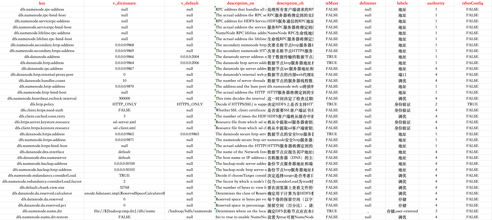
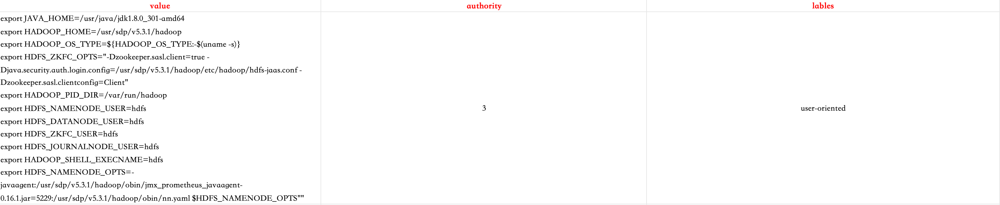

<h1 align="center" style="margin: 30px 0 30px; font-weight: bold;">sugon-data-platform</h1>
<h4 align="center">SDP服务管理基础框架</h4>
<p align="center">
	<a href="https://github.com/gaoshq7/cornerstone/blob/main/LICENSE"></a>
</p>

---

# 简介

`sugon-data-platform`是SDP服务管理基础框架，在框架中实现了服务启停、服务扩容、服务安装以及自定义函数等等功能接口。

---

# 功能

- **主机管理**：支持主机端口检测、主机扩容/缩容、主机进程管理等功能。
- **服务管理**：支持服务安装、启停、卸载等运维功能以及自定义功能接口。
- **配置文件管理**：支持服务相关配置文件修改、同步、历史回退、配置字典等功能。
- **进程管理**：支持进程安装、启停、卸载、扩容/缩容等基础功能以及自定义功能接口。
- **SDP版本管理**：支持多个SDP版本切换。
- **部署模式管理**：支持多个资源分配模式切换。
- **SDP定制**：支持SDP环境、服务集合、配置文件、进程树等层级的自由扩展与定制化操作。

---

# 编写SDP环境

## SDK引入

```xml
<dependency>
    <groupId>io.github.gaoshq7</groupId>
    <artifactId>sdp-core</artifactId>
    <version>1.0.0-SNAPSHOT</version>
</dependency>
```
## SDK接口使用

### SDP包编写

1. 创建SDP所有版本环境编译根目录（例如：io.github.sdp）。
2. 在编译环境根目录下面按规范创建若干个SDP环境版本（ ⚠️ 根目录的下一层编译目录需要使用去除“.”的SDP版本号作为名称，例如：io.github.sdp.v531，则该环境版本号为“v5.3.1”）。
3. 在上一步创建的编译目录下新建包元数据信息：package-info.java，内容如下：
```java
@Sdp(version = "v5.3.1")  // @Sdp中的version信息必须与该java文件所在最后一层编译目录相匹配，否则sdp版本无效。
package io.github.sdp.v531;

import cn.gsq.sdp.core.annotation.Sdp;
```
4. 在SDP版本编译根目录（例如：io.github.sdp.v531）下任意位置创建主机代理类：
```java
package io.github.sdp.v531;

@Host()
public class SdpHost531Impl extends AbstractHost {
   // 该类必须使用“@Host()”注解且必须继承“AbstractHost”父类，有且只能有一个。
}
```
5. 在SDP版本编译根目录（例如：io.github.sdp.v531）下任意位置创建若干个集群部署模式：
```java
package com.sugon.gsq.libraries.v531.entity;

@Mode("主从混合") // 模式类必须使用@Mode()注解且必须是枚举类且必须实现“HostGroup”接口。
public enum MasterSlave implements HostGroup {
   
   // ⚠️ 不要覆盖“HostGroup”中的“mode()”函数，即便要覆盖也必须返回值与@Mode("主从混合")注解中的属性一致。
   MASTER{
       @Override
       public int min() {
           return 2;
       }

       @Override
       public int max() {
           return 2;
       }

       @Override
       public String description() {
           return "运行与使用终端交互的服务主进程";
       }
   },
    COMMON{
        @Override
        public int min() {
            return 3;
        }

        @Override
        public int max() {
            return -1;
        }

        @Override
        public String description() {
            return "运行分布式元数据服务进程";
        }
    },
    WEB{
        @Override
        public int min() {
            return 1;
        }

        @Override
        public int max() {
            return 1;
        }

        @Override
        public String description() {
            return "运行组件的页面终端服务进程";
        }
    },
    DATA{
        @Override
        public int min() {
            return 3;
        }

        @Override
        public int max() {
            return -1;
        }

        @Override
        public String description() {
            return "运行数据存储进程";
        }
    },
    TASK{
        @Override
        public int min() {
            return 3;
        }

        @Override
        public int max() {
            return -1;
        }

        @Override
        public String description() {
            return "运行数据计算进程";
        }
    },
    HTAP{
        @Override
        public int min() {
            return 3;
        }

        @Override
        public int max() {
            return -1;
        }

        @Override
        public String description() {
            return  "运行Doris服务计算存储进程";
        }
    },
    OLAP{
        @Override
        public int min() {
            return 2;
        }

        @Override
        public int max() {
            return -1;
        }

        @Override
        public String description() {
            return "运行Presto服务计算进程";
        }
    }
    
}
```

### 服务编写

1. 在SDP版本编译根目录（例如：io.github.sdp.v531）下任意位置添加服务代理类（必须添加@Serve注解且实现AbstractServe抽象类）：
```java
package io.github.sdp.v531.spark;

@Serve(
       version = "3.3.3",    // 服务版本（✅必填）
       handler = ServeHandler.FRAGMENT_ALONE_MODE, // 服务架构模式（✅必填）
       type = ClassifyHandler.BIGDATA,   // 服务类型（选填）
       depends = {Zookeeper.class, YARN.class},    // 服务依赖（选填）
       appends = {
               "HDFS:core-site.xml:default:/spark/conf/",
               "HDFS:hdfs-site.xml:default:/spark/conf/",
               "YARN:yarn-site.xml:default:/spark/conf/",
               "Hive:hive-site.xml:default:/spark/conf/"
       },    // 外部配置文件依赖（选填）
       labels = {"计算框架", "批处理"},     // 服务标签（选填）
       description = "Hadoop分布式文件存储系统",  // 描述信息（必填）
       all = true,   // 下载策略：true为所有节点全部下载；false为服务涉及到的节点下载（选填）
       pkg = "spark",   // 服务对应的安装包所在目录（选填）
       order = 1     // 服务在列表中展示顺序（✅必填）
)
public class Spark extends AbstractServe {
   
   // 其它函数非必要不建议覆盖
   
   @Override
   protected void initServe(Blueprint.Serve blueprint) {
       // 蓝图下发到服务最初始函数（选填）
   }

   @Override
   protected void afterInstall(Blueprint.Serve blueprint) {
       // 所有进程安装启动完成后，服务信息写入数据库之前执行（选填）
       // ⚠️ 此时服务不一定可用且安装正确
   }

   @Override
   protected void callbackServe() {
       // 所有进程正确安装启动完成且服务服务信息已入库，服务可用（选填）
   }

   @Override
   protected void afterRecover(AbstractServe serve) {
       // 进程、配置文件全部正确卸载完成后，没有同步数据库之前（选填）
   }

   @Override
   protected void extendProperties(Map<String, String> properties) {
       // 服务信息展示接口，已存在服务名称、版本号信息（选填）
   }

   @Override
   public List<WebUI> getWebUIs(){
       // 服务url链接信息接口（选填）
       return null;
   }

   @Override
   public RpcRespond<String> isServeAvailable() {
       // 服务可用性检测，默认逻辑是服务状态检测（选填）
       return null;
   }
   
   // @Function功能函数可以有若干个

   @Function(id = "ACTIVEAUTHORITY", name = "开启权限管理")
   public void activeAuthority() {
       // 服务功能函数“@Function”中的“id”在当前服务下必须唯一
   }

   @Available(fid = "ACTIVEAUTHORITY")
   public boolean isActiveOn() {
       // 判定id为ACTIVEAUTHORITY的函数当前是否可用
       return true;
   }
   
}
```

### 配置文件编写

1. 在SDP版本编译根目录（例如：io.github.sdp.v531）下任意位置添加配置文件代理类（必须添加@Config注解且实现AbstractConfig抽象类）：
```java
package io.github.sdp.v531.prestosql.config;

@Config(
       master = PrestoSQL.class,  // 所属服务（✅必填）
       type = "cfg",         // 配置文件数据类型（✅必填）
       path = "/presto/etc/config.properties",    // 配置文件地址（✅必填）
       description = "presto核心配置文件",     // 配置文件描述信息（选填）
       branches = {"master", "worker"},      // 配置文件分支（选填）
       show = false,         // 是否展示给用户以供修改（选填）
       order = 1             // 配置文件展示顺序（✅必填）
)
public class CoreSiteXml extends AbstractConfig {
   
   // 其它函数非必要不建议覆盖

   @Override
   protected List<BranchModel> initContents(Map<String, Map<String, String>> branches, Blueprint.Serve serve) {
       // 将要安装服务时根据蓝图提交的主机、服务等信息修改相关配置文件分支的配置项，返回所有分支的相信信息（选填）
       // ⚠️ 默认逻辑：default分支不需要任何修改，同步主机根据服务是否需要全部主机安装来确定
       return null;
   }

}
```
2. 在resources目录下创建该配置文件代理类对应的默认配置数据信息文件，包含两种情况：
   - `配置文件不存在分支：`resources/服务名称/配置文件名称$.csv（例如：resources/HDFS/core-site.xml$.csv）。“$”可选填，用来标明该文件中是否包含配置字典。
   - `配置文件存在分支：`resources/服务名称/配置文件前缀/分支名称.配置文件后缀$.csv（例如：resources/PrestoSQL/config/master.properties$.csv）
3. 配置文件数据文件格式统一使用csv，包含两种编写方式：
   - `配置文件内容以“key-value”方式管理：`
     
   - `配置文件内容以纯文本方式管理：`
     

### 服务进程编写

1. 在SDP版本编译根目录（例如：io.github.sdp.v531）下任意位置添加服务进程代理类（必须添加@Process注解且实现AbstractProcess<T>抽象类）：
```java
package io.github.sdp.v531.hdfs.process;

@Process(
        master = HDFS.class,    // 所属服务（✅必填）
        depends = JournalNode.class,    // 前置进程（选填）
        companions = Zkfc.class,        // 伴生进程（选填）
        excludes = DataNode.class,      // 互斥进程（选填）
        handler = ProcessHandler.MASTER,    // 进程类型（✅必填）
        groups = {
                @Group(mode = MasterSlaveSeparation.class, name = "MASTER"),
                @Group(mode = CunSuanFenLi.class, name = "COMPUTE")
        },  // 不同模式中所在的主机分组（选填）
        mark = "NameNode",  // 进程唯一标识，在ps -ef | grep xxx 时使用（✅必填）
        home = "/hadoop",   // 运行各种命令时所在的根目录（✅必填）
        start = "./bin/hdfs --daemon start namenode",   // 启动命令（✅必填）
        stop = "./bin/hdfs --daemon stop namenode",     // 停止命令（✅必填）
        dynamic = true,     // 是否支持 扩容/缩容（选填）
        description = "HDFS主进程（高可用）",   // 进程描述信息（选填）
        order = 2,  // 展示顺序（✅必填）
        min = 2,     // 最小主机数量（选填）
        max = 2    // 最大主机数量（选填）
)
public class NameNode extends AbstractProcess<SdpHost531Impl> {
    
    // 其它函数非必要不建议覆盖

    @Override
    protected void initProcess() {
        // 将蓝图中该进程所覆盖的主机添加到“this.hosts”以后执行该函数（选填）
    }

    @Override
    public Integer getPort() {
        // 获取该进程对外的端口号，不覆盖则使用@Process中的mark属性到主机上寻找（选填）
        return 9999;
    }

    @Override
    protected void reset() {
        // 卸载时停止所有主机上的该进程后执行此函数（选填）
    }

    @Override
    protected void extend(AbstractHost abstractHost) {
        // 进程扩容逻辑（选填）
        // ⚠️ @Process注解dynamic = true时，必须覆盖该函数
    }

    @Override
    protected void shorten(AbstractHost abstractHost) {
        // 进程缩容逻辑（选填）
        // ⚠️ @Process注解 dynamic = true 时，必须覆盖该函数
    }

    @Override
    protected String getLogFilePath() {
        // 获取该进程日志所在目录（选填）
        return this.getHome() + StrUtil.SLASH + "logs";
    }

    @Override
    protected String getLogFileName(String hostname) {
        // 根据主机名获取该进程日志所在目录下的日志文件（选填）
        return "hadoop-hdfs-namenode-"+hostname+".log";
    }

}
```